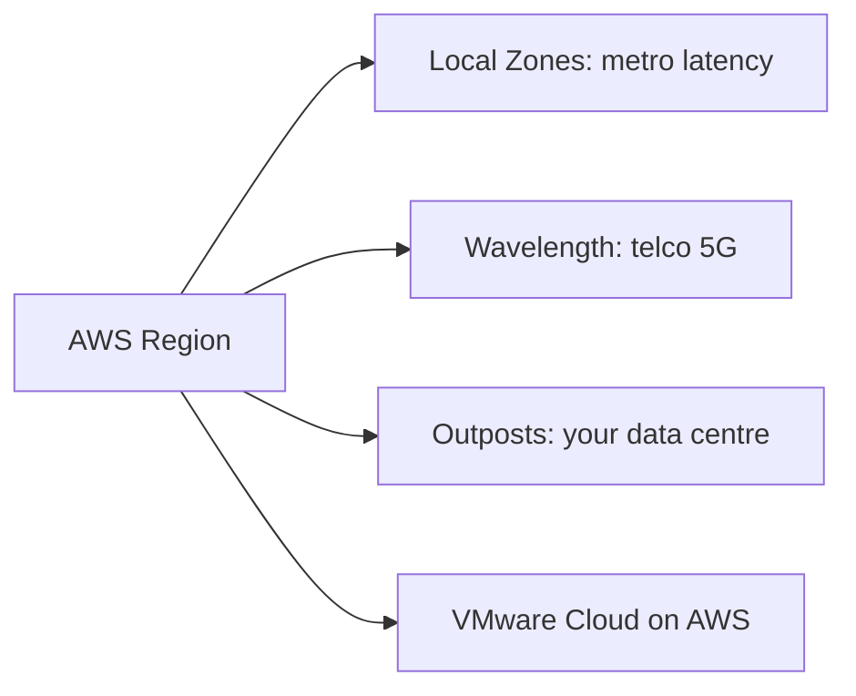

# AWS Hybrid and Edge Compute

```mermaid
flowchart LR
    R["AWS Region"] --> LZ["Local Zones: metro latency"]
    R --> WL["Wavelength: telco 5G"]
    R --> OP["Outposts: your data centre"]
    R --> VM["VMware Cloud on AWS"]
```

## In this topic
- [[AWS Local Zones]]
- [[AWS Outposts]]
- [[AWS Wavelength]]
- [[VMware Cloud on AWS]]

---
**Map:** [[Compute Map]]
