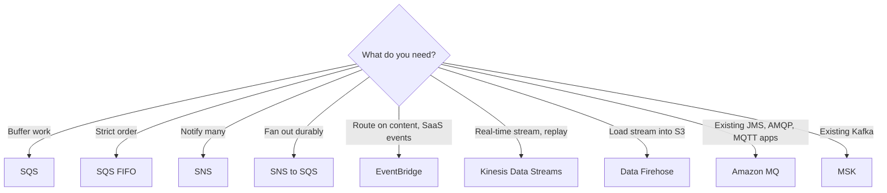

# Messaging Selection Guide

```mermaid
flowchart TD
    Q{"What do you need?"}
    Q -->|"Buffer work"| S["SQS"]
    Q -->|"Strict order"| F["SQS FIFO"]
    Q -->|"Notify many"| N["SNS"]
    Q -->|"Fan out durably"| FO["SNS to SQS"]
    Q -->|"Route on content, SaaS events"| E["EventBridge"]
    Q -->|"Real-time stream, replay"| K["Kinesis Data Streams"]
    Q -->|"Load stream into S3"| D["Data Firehose"]
    Q -->|"Existing JMS, AMQP, MQTT apps"| M["Amazon MQ"]
    Q -->|"Existing Kafka"| MS["MSK"]
```

## Exam tasks
- [[Task 2.1 Design scalable and loosely coupled architectures]]

---
**Up:** [[Decision Guides Map]]
