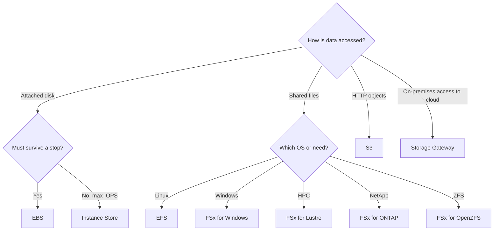

# Storage Selection Guide

```mermaid
flowchart TD
    Q{"How is data accessed?"}
    Q -->|"Attached disk"| B{"Must survive a stop?"}
    B -->|"Yes"| E["EBS"]
    B -->|"No, max IOPS"| I["Instance Store"]
    Q -->|"Shared files"| F{"Which OS or need?"}
    F -->|"Linux"| EF["EFS"]
    F -->|"Windows"| W["FSx for Windows"]
    F -->|"HPC"| L["FSx for Lustre"]
    F -->|"NetApp"| O["FSx for ONTAP"]
    F -->|"ZFS"| Z["FSx for OpenZFS"]
    Q -->|"HTTP objects"| S["S3"]
    Q -->|"On-premises access to cloud"| G["Storage Gateway"]
```

## Exam tasks
- [[Task 3.1 Determine high-performing and or or scalable storage solutions]]

---
**Up:** [[Decision Guides Map]]
