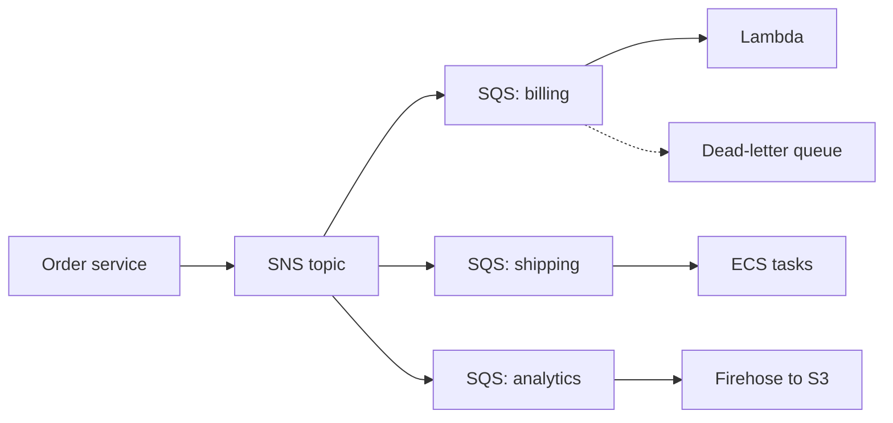

# Pattern Fan-Out Order Processing

```mermaid
flowchart LR
    O["Order service"] --> T["SNS topic"]
    T --> Q1["SQS: billing"]
    T --> Q2["SQS: shipping"]
    T --> Q3["SQS: analytics"]
    Q1 --> W1["Lambda"]
    Q2 --> W2["ECS tasks"]
    Q3 --> W3["Firehose to S3"]
    Q1 -.-> D["Dead-letter queue"]
```

Each consumer has a durable queue, so a slow or failed consumer doesn't affect the others. See [[SNS and SQS Fan-Out]].

---
**Up:** [[Architecture Patterns]]
