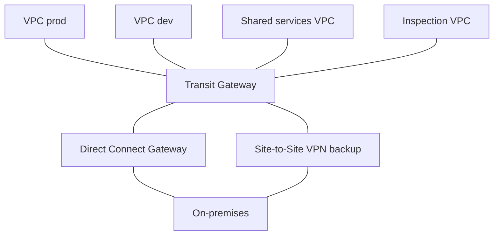

# Pattern Hub-and-Spoke Network

```mermaid
flowchart TB
    T["Transit Gateway"]
    V1["VPC prod"] --- T
    V2["VPC dev"] --- T
    V3["Shared services VPC"] --- T
    V4["Inspection VPC"] --- T
    T --- D["Direct Connect Gateway"]
    D --- OP["On-premises"]
    T --- VPN["Site-to-Site VPN backup"]
    VPN --- OP
```

## Exam tasks
- [[Task 3.4 Determine high-performing and or or scalable network architectures]]

---
**Up:** [[Architecture Patterns]]
