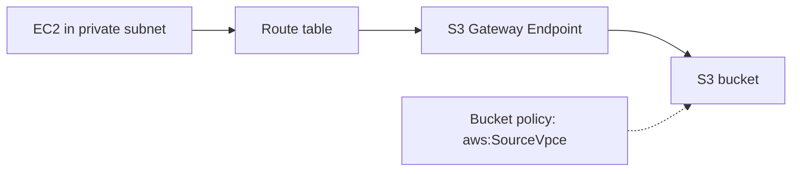

# Pattern Private S3 Access

```mermaid
flowchart LR
    E["EC2 in private subnet"] --> RT["Route table"]
    RT --> GE["S3 Gateway Endpoint"]
    GE --> S["S3 bucket"]
    P["Bucket policy: aws:SourceVpce"] -.-> S
```

Free, private, and needs no [[NAT Gateways|NAT Gateway]]. See [[VPC Endpoints]].

---
**Up:** [[Architecture Patterns]]
