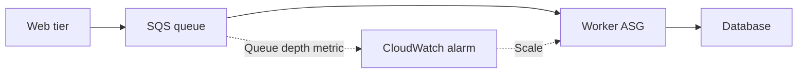

# Pattern Queue-Based Load Leveling

```mermaid
flowchart LR
    P["Web tier"] --> Q["SQS queue"]
    Q --> W["Worker ASG"]
    Q -. "Queue depth metric" .-> A["CloudWatch alarm"]
    A -. "Scale" .-> W
    W --> D["Database"]
```

The queue absorbs spikes and protects the database. See [[SQS and Auto Scaling Patterns]].

---
**Up:** [[Architecture Patterns]]
