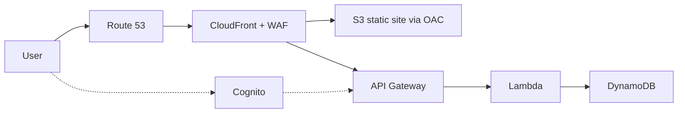

# Pattern Serverless Web App

```mermaid
flowchart LR
    U["User"] --> R["Route 53"] --> CF["CloudFront + WAF"]
    CF --> S["S3 static site via OAC"]
    CF --> API["API Gateway"]
    API --> L["Lambda"]
    L --> D["DynamoDB"]
    U -.-> C["Cognito"]
    C -.-> API
```

---
**Up:** [[Architecture Patterns]]
